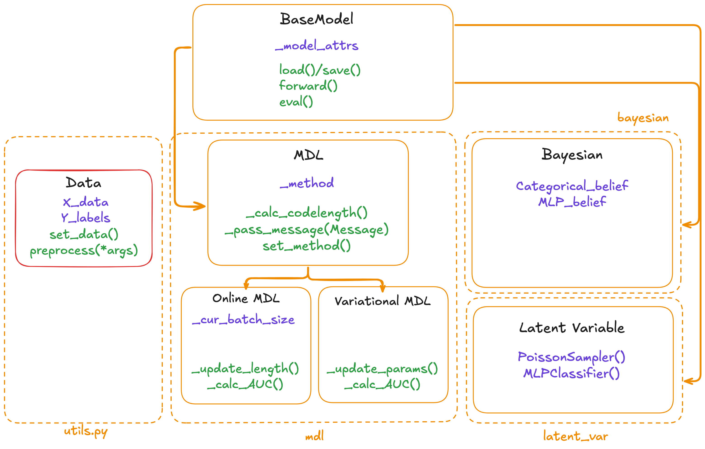

# MDL for language model evaluation

[](#license)
<div align="center">


[](https://intsystems.github.io/MDL_for_Language_Models/) [](/docs/ "Go to project documentation")

</div>

## Motivation
One of the method of language model analysis (and usage) is probing: we train a classifier for some specific layer of language model to extract some information about the analyzed words. For example, for PoS or syntactic properties of the words. The question we want to analyze is that which layer should we use, how should we choose this layer, and, generally, how much information about the downstream task can we capture from this layer/model. For this task multiple researchers proposed different theoretical frameworks. We propose to implement and compare different approaches used for this task.

## Key Works

The key works are:
1. T. Pimentel and R. Cotterell. [A Bayesian Framework for Information-Theoretic Probing](https://arxiv.org/abs/2109.03853.).
2. E. Voita and I. Titov. [Information-theoretic probing with minimum description length](https://arxiv.org/abs/2003.12298).
3. K. Stan ́czak, L.T. Hennigen, A. Williams, R. Cotterell, and I. Augenstein. [A latent-variable model for intrinsic probing](https://arxiv.org/abs/2201.08214).

## Members
1. [Anastasia Voznyuk](https://github.com/natriistorm)  (Project wrapping, Blog Post, Algorithm 1)
2. [Nikita Okhotnikov](https://github.com/Wayfarer123) (Library Wrapping, , Algorithm 2)
3. [Anna Grebennikova]() (Base code implementation, Demo completion, Algorithm 2)
4. [Yuri Sapronov](https://github.com/Sapr7) (Tests writing, Documentation Writing), Algorithm 3)

## Blogpost Link

[Overleaf Read-only link to the draft](https://www.overleaf.com/read/mhznbfwfrgpg#050aed)

## Repository structure
```
problib/
    ├── __init__.py
    ├── utils.py
    ├── setup.py
    ├── mdl/
        ├── __init__.py
        ├── online_probing.py
        ├── variational_probing.py
    ├── nn/
        ├── __init__.py
        ├── probing.py
    ├── bayesian
        ├── __init__.py
        ├── probing.py
tests/
    ├── tests.py

```

## Project scheme


**Model** class will be the parent class for
1. **MDL**
2. **Bayesian**
3. **Latent_Var**.


**MDL**, in turn. will be parent **MDLOnlineProbing** and **MDLVariationalProbing**.

**Model**:
```
Attributes:
_model_attrs: Contains the model’s internal attributes.
    
Methods:
_calc_loss(): Likely computes the model’s loss function.
forward(): A common method in machine learning for performing the forward pass of the model.
evaluate(): Evaluates the model’s performance.
```
**MDL(Model)**:
```
Attributes:
_method: Refers to the method used in this section (online or variational).

Methods:
_calc_codelength(): calculates the code length as per the MDL principle.
_pass_message(Message): passes a Message object for further processing.
set_method(): sets the _method used for the MDL calculation.
```

**MDLOnlineProbing(MDL)**:
```
Attributes:
_cur_batch_length

Methods: 
_update_length() - of the message passed
_calc_AUC() - calculate AUC for current batch len, called in forward
```

**MDLVariationalProbing(MDL)**:
```
Attributes:
_cost_of_message - passed cost of the message
_param_family - that Bob and Alice agreed to use

Methods: 
_update_params() - of the param family
_calc_AUC()
```

**Bayesian(Model):**
```
Attributes:
_priors: Represents the priors used in Bayesian computation.

Methods:
_calc_conditional(): Calculates conditional probabilities.
_calc_unconditional(): Calculates unconditional probabilities.
```

**Latent Variable(Model):**
```
Methods:
_get_set_of_neurons(): determine a set of neurons for probing.
_run_Monte_Carlo(): Performs Monte Carlo simulations
```

**Data**:
```
X_data: Feature data for the model.
Y_labels: Labels corresponding to the data.
set_data(): Sets or loads the data.
preprocess(*args): Preprocesses the data, scaling or normalizing it.
```

**Message:**
```
_type: Refers to the type of message being passed.
```

## Stack
**NLP Framework**: jiant, spaCy, Flair

**Basic code**: PyTorch

**Configs to interact with library**: YAML

**Bayesian instruments**: BayesPy

**Deploy**: HF Spaces, Gradio


## Master branch
By desing, master branch is protected from committing.  You should make pull requests to make changes into it.

## Documentation and test coverage
Documentation and test coverage badges can be updated automatically using [github actions](.github/workflows).

Initially both of these workflows are disabled (but can be run via "Actions" page).

To enable them automatically on push to master branch, change corresponding "yaml" files.
